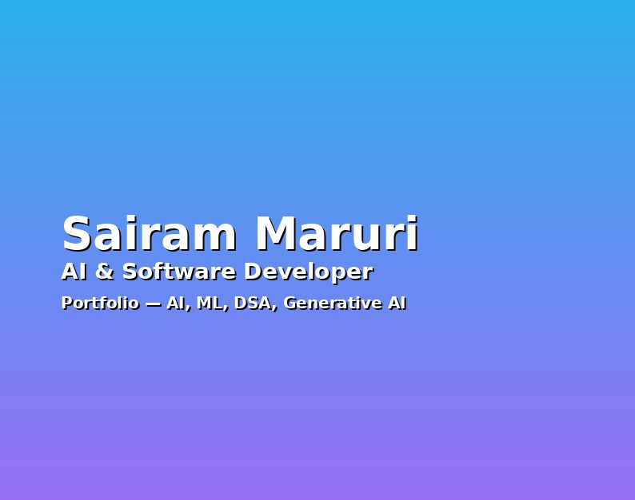

<div align="center">
  
  
  # 🚀 AI-Powered Portfolio
  **A modern, interactive portfolio website with AI-powered chat capabilities**  
  [View Demo](https://saiii.in)
</div>

---

## ✨ Features

- 🤖 **AI Chat Assistant** - Interactive chat powered by n8n webhooks for intelligent conversations
- 🎨 **Modern UI/UX** - Built with shadcn/ui components and Tailwind CSS
- ⚡ **Lightning Fast** - Powered by Vite for instant hot module replacement
- 📱 **Fully Responsive** - Seamless experience across all devices
- 🎯 **Type-Safe** - Written in TypeScript for robust code quality
- 🎭 **Smooth Animations** - Engaging cursor effects and transitions
- 🌐 **Multi-Page Routing** - React Router for seamless navigation
- 📊 **Dynamic Sections** - About, Projects, Skills, Education, Blog, Certifications, and Contact
- 🔍 **SEO Optimized** - Proper meta tags and sitemap configuration
- 📄 **Resume Integration** - Direct PDF resume viewing

## 🛠️ Tech Stack

### Core
- **React 18.3** - UI library
- **TypeScript 5.8** - Type safety
- **Vite 5.4** - Build tool and dev server

### UI & Styling
- **Tailwind CSS 3.4** - Utility-first CSS framework
- **shadcn/ui** - High-quality React components
- **Radix UI** - Accessible component primitives
- **Lucide React** - Beautiful icon library
- **Framer Motion** (via class-variance-authority) - Animations

### State & Data
- **TanStack Query 5.83** - Server state management
- **React Hook Form 7.61** - Form handling
- **Zod 3.25** - Schema validation

### Routing & Navigation
- **React Router DOM 6.30** - Client-side routing

### Additional Libraries
- **date-fns** - Date utilities
- **Recharts** - Data visualization
- **Sonner** - Toast notifications
- **next-themes** - Dark mode support

## 🚀 Getting Started

### Prerequisites

- Node.js 18+ and npm/yarn/pnpm
- Git

### Installation

1. **Clone the repository**
   ```bash
   git clone https://github.com/sairam3824/Ai-Portfolio.git
   cd Ai-Portfolio
   ```

2. **Install dependencies**
   ```bash
   npm install
   # or
   yarn install
   # or
   pnpm install
   ```

3. **Set up environment variables**
   ```bash
   cp .env.example .env
   ```
   
   Edit `.env` and add your n8n webhook URL:
   ```env
   VITE_N8N_WEBHOOK_URL=your_actual_webhook_url_here
   ```

4. **Start the development server**
   ```bash
   npm run dev
   ```
   
   Open [http://localhost:5173](http://localhost:5173) in your browser.

## 📦 Build & Deploy

### Build for Production

```bash
npm run build
```

This creates an optimized production build in the `dist` folder.

### Preview Production Build

```bash
npm run preview
```

### Deploy to Vercel

The project includes a `vercel.json` configuration for seamless deployment:

```bash
# Install Vercel CLI
npm i -g vercel

# Deploy
vercel
```

Or connect your GitHub repository to Vercel for automatic deployments.

## 📁 Project Structure

```
Ai-Portfolio/
├── public/                      # Static assets
│   ├── preview.png             # Portfolio preview image
│   ├── robots.txt              # SEO robots file
│   └── Sai_Ram_Maruri_Resume_2025.pdf
├── src/
│   ├── assets/                 # Images and media
│   ├── core/                   # Core app components
│   │   ├── App.tsx            # Main app component
│   │   ├── Index.tsx          # Home page
│   │   └── NotFound.tsx       # 404 page
│   ├── features/              # Feature modules
│   │   ├── about/             # About section
│   │   ├── blog/              # Blog section
│   │   ├── certifications/    # Certifications section
│   │   ├── chat/              # AI chat feature
│   │   ├── contact/           # Contact section
│   │   ├── education/         # Education section
│   │   ├── projects/          # Projects section
│   │   └── skills/            # Skills section
│   ├── shared/                # Shared components & utilities
│   │   ├── components/        # Reusable components
│   │   ├── ui/                # shadcn/ui components
│   │   └── lib/               # Utility functions
│   ├── styles/                # Global styles
│   └── main.tsx               # App entry point
├── .env.example               # Environment variables template
├── vercel.json                # Vercel deployment config
├── tailwind.config.ts         # Tailwind configuration
├── tsconfig.json              # TypeScript configuration
└── vite.config.ts             # Vite configuration
```

## 🎨 Customization

### Update Personal Information

1. **Profile Details** - Edit `src/core/Index.tsx`
2. **About Section** - Modify `src/features/about/AboutSection.tsx`
3. **Projects** - Update `src/features/projects/ProjectsSection.tsx`
4. **Skills** - Edit `src/features/skills/SkillsSection.tsx`
5. **Resume** - Replace `public/Sai_Ram_Maruri_Resume_2025.pdf`

### Customize Theme

Edit `tailwind.config.ts` to modify colors, fonts, and other design tokens.

### Configure AI Chat

The chat feature uses n8n webhooks. Set up your workflow:

1. Create an n8n workflow with a webhook trigger
2. Add your AI logic (OpenAI, Claude, etc.)
3. Copy the webhook URL to your `.env` file

## 🧪 Available Scripts

```bash
npm run dev          # Start development server
npm run build        # Build for production
npm run build:dev    # Build in development mode
npm run preview      # Preview production build
npm run lint         # Run ESLint
```

## 🤝 Contributing

Contributions are welcome! Please feel free to submit a Pull Request.

1. Fork the project
2. Create your feature branch (`git checkout -b feature/AmazingFeature`)
3. Commit your changes (`git commit -m 'Add some AmazingFeature'`)
4. Push to the branch (`git push origin feature/AmazingFeature`)
5. Open a Pull Request

## 📝 License

This project is licensed under the Apache License 2.0 - see the [LICENSE](LICENSE) file for details.


## 🙏 Acknowledgments

- [shadcn/ui](https://ui.shadcn.com/) for the beautiful component library
- [Radix UI](https://www.radix-ui.com/) for accessible primitives
- [Lucide](https://lucide.dev/) for the icon set
- [Vercel](https://vercel.com/) for hosting

---
